# forge-ops — story-driven board for agent sessions

forge-ops is a board that runs Claude Code sessions on user stories, each paired with a twin test story, and refuses to let a story move forward without proof.

**Look at it without installing anything:** [techmefr.github.io/forge-ops](https://techmefr.github.io/forge-ops/) — the demonstration board, frozen, with its guided tour in seven languages. Nothing runs there; it is a visit, not a trial. A presentation page, in the same seven languages, is at [techmefr.github.io/forge-ops/about](https://techmefr.github.io/forge-ops/about/).

**Install the desktop app:** Windows, macOS and Linux installers are on the [releases page](https://github.com/techmefr/forge-ops/releases/latest). The app updates itself, signs in with Google or Microsoft, and keeps a list of servers you can switch between. See [the desktop app](#the-desktop-app).

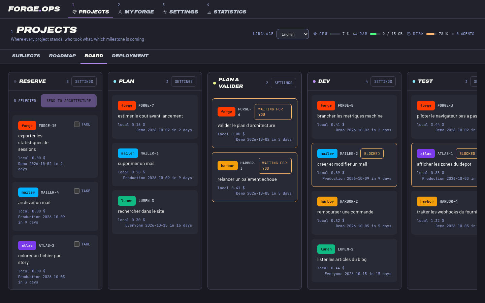

It speaks French, English, German, Spanish, Italian, Portuguese and Chinese, in six colour themes (light and dark) and four text sizes, down to a phone screen.

**Status.** The board, the proof checks, the guardrail, the autopilot, the desktop app and the seven languages exist and are used. The split into a shared server and an executing instance is in progress: [docs/Architecture.md](docs/Architecture.md) says what is being built and why, [docs/Deployment.md](docs/Deployment.md) says how it is run, and [section 11](#11-implementation-state) lists every block.

## 0. What it looks like

| | |
|---|---|
| 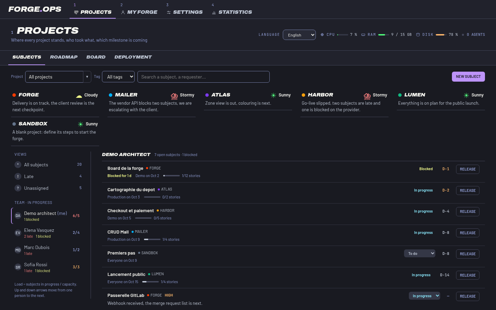 **Subjects** — every project at a glance, who took what. | 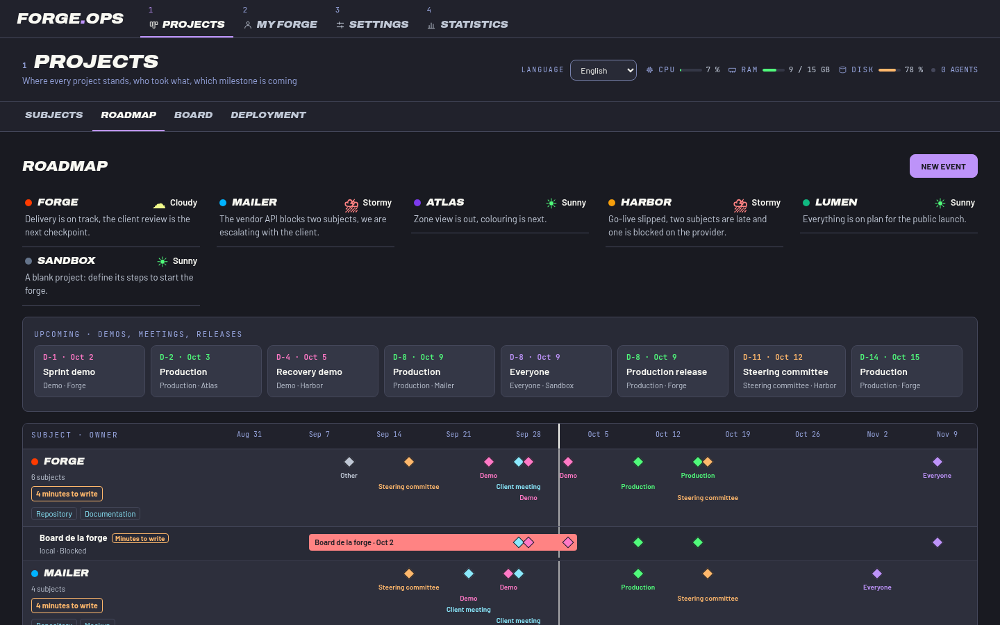 **Roadmap** — what a project manager shows at the daily. |
| 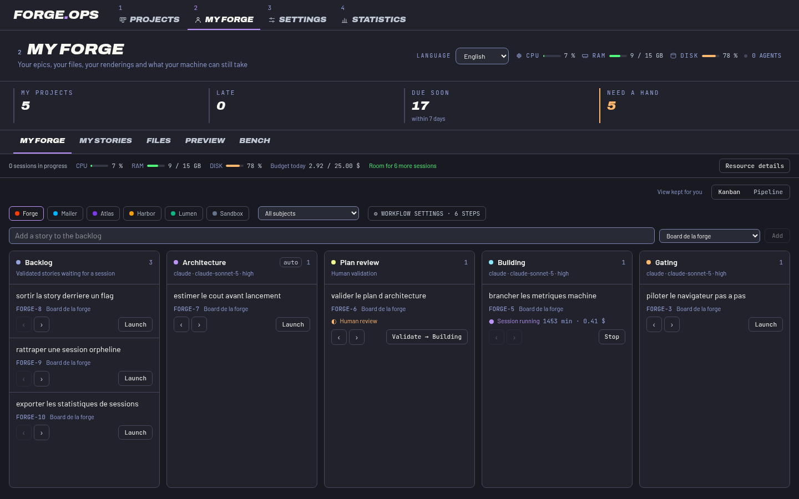 **My forge** — your epics, your files, what your machine can still take. | 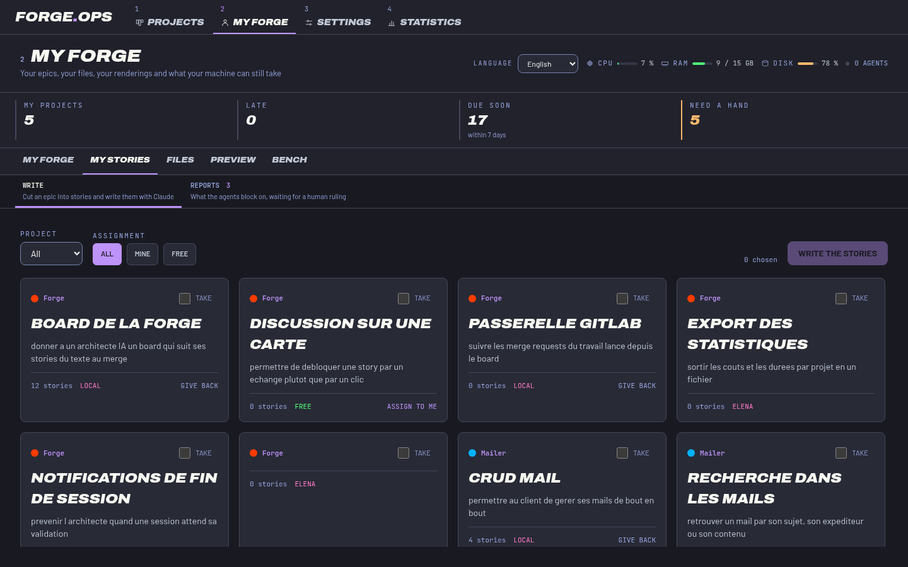 **Stories** — pick an epic, write with Claude, then the twin test story. |
| 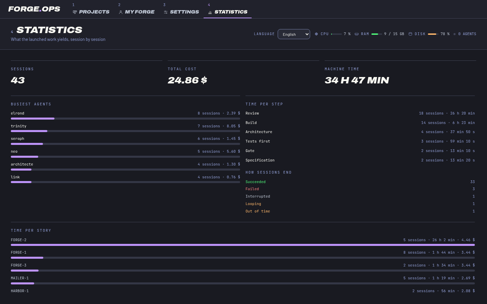 **Statistics** — what it costs and where it goes. | 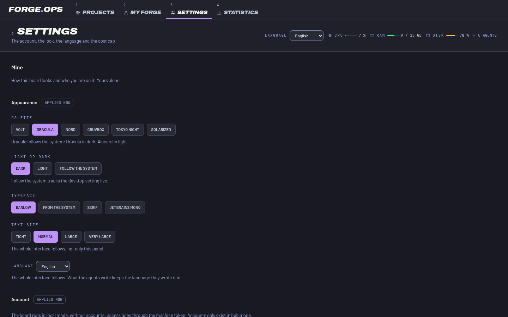 **Settings** — six palettes, light and dark, four fonts, four sizes. |

| Volt | Dracula | Nord |
|---|---|---|
| 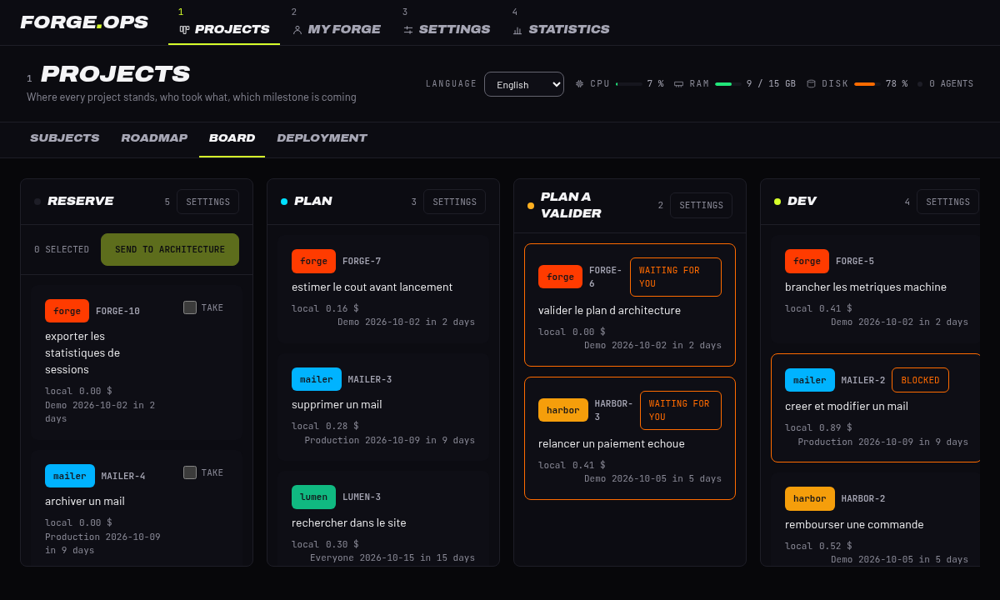 | 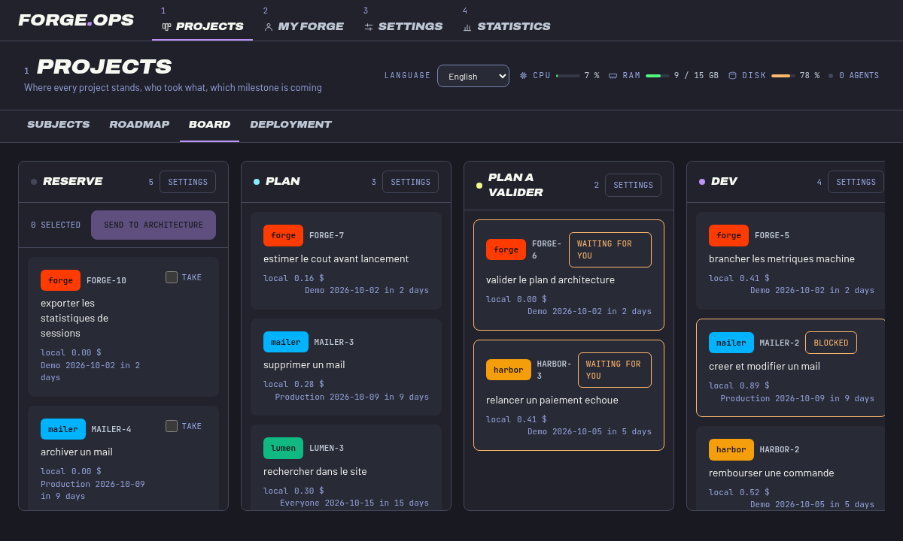 | 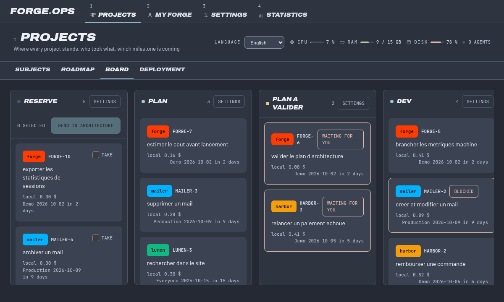 |
| **Gruvbox** | **Tokyo Night** | **Solarized** |
| 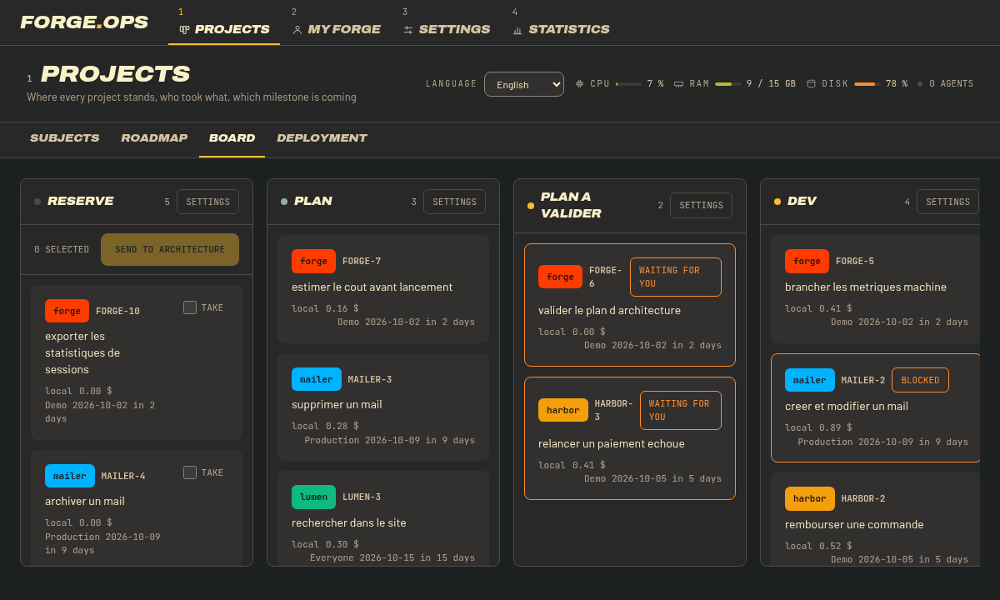 | 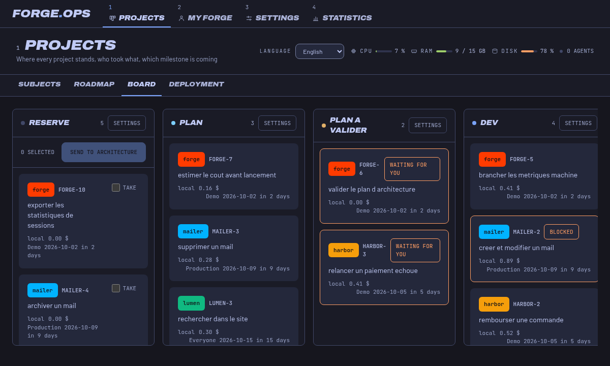 | 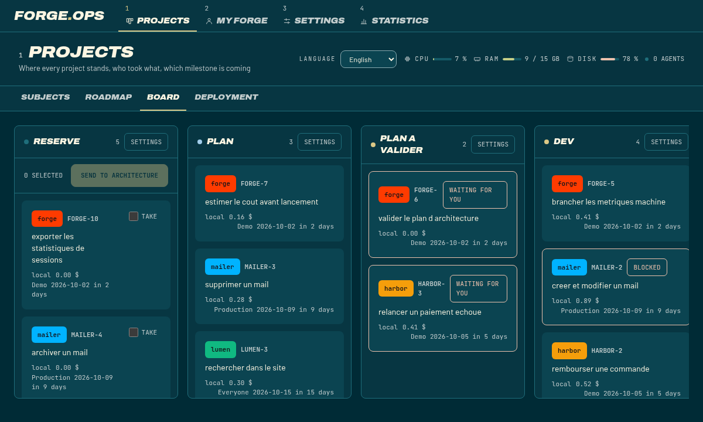 |

<p align="center">
  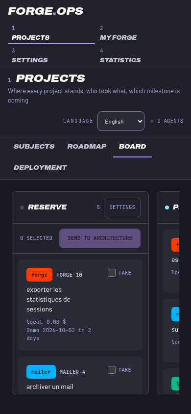
  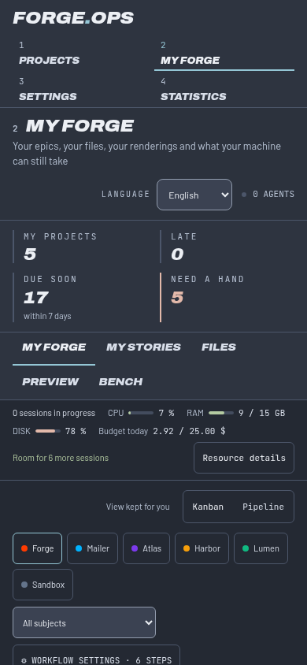
</p>

## 1. The problem addressed

An agent coding on its own produces three classes of friction:

1. **Generated TDD can be mimicked.** A test written after the code, or modified to pass, costs more than no test at all: it reassures.
2. **The displayed state is not the real state.** An agent that crashes in the middle of a multi-file operation leaves a database that is consistent with itself and wrong with respect to the disk.
3. **Agents step on each other.** Two sessions touching the same file without knowing it produce a conflict discovered at merge time.

## 2. The decisions taken

- **One story, one test twin.** `story.kind` is either `functional` or `test`, and the twin points at the functional one through `twin_of_story_id`. A functional story does not leave `drafting` without its twin, and the board refuses the `spec_done` checkpoint without it. The scope is described across two objects, not one.
- **A step is proven by a file, never by an assertion.** Every checkpoint requires an `evidence_path` (`NOT NULL` in the database) pointing at a file under `.claude/evidence/<REFERENCE>/`. No proof, no checkpoint.
- **The sequence is ordered and the board enforces it.** A step crossed out of order, or twice, is refused with a 409. This is not a documented convention, it is a server-side refusal.
- **A single source of truth.** One SQLite database in WAL mode, read by the API and by the board. No duplicated state to synchronize.
- **The guardrail fails closed.** One `PreToolUse` hook carries two refusals — the deny list on `Bash|PowerShell`, the scope guard on `Edit|Write` — and blocks whenever it cannot decide: unreadable deny list, incomprehensible payload. The previous version failed open: deleting the script silently deleted all the protection.
- **File attribution comes from the hooks, not from a watcher.** Claude Code posts every `Edit`/`Write` to the API; the board knows which story touched which file and detects paths claimed by several stories.
- **Reservation, not a bare hash.** The branch name's hash only seeds a candidate port; the repository walks the range from there, checking both the `port_reservation` table and whether the port actually binds, and reuses a worktree's held port when it is still free. A hash alone collides by birthday paradox well before the range fills up.
- **The last gate is human.** No agent moves a story to `done`.

## 3. Work hierarchy

A director writes **epics only**: the high-level business need. The AI architects decompose the epic into functional stories, each with its test twin. The story goes all the way down to the code.

```
project ─┬─ tag, link, event, risk, decision, weather
         └─ epic ─┬─ tag, link, event, state history
                  └─ story (functional) ─── twin_of ──→ story (test)
                   │
                   ├── acceptance_criterion
                   ├── story_dependency  (blocked, waiting on another one)
                   ├── checkpoint        (6 steps, each with its proof)
                   ├── agent_session → file_touch
                   └── review_finding    (quality | security | accessibility)
```

The full schema is in [db/forge.sql](db/forge.sql).

## 4. The sequence

Eight steps, six checkpoints. `/PLAN` and `/CODE-SIMPLIFY` have no checkpoint of their own: the first is proven by `arch_done`, the second is verified by the test suite already being green.

| Step | Checkpoint proven | Expected proof |
|---|---|---|
| `/SPEC` | `spec_done` | `evidence/<REF>/spec.md` — scope, acceptance criteria, out of scope, twin written |
| `/PLAN` | `arch_done` | `evidence/<REF>/arch.md` — breakdown, placement across the layers, risks |
| `/TEST` | `tests_written` | `evidence/<REF>/tests.md` — the **red** tests, output pasted in |
| `/BUILD` | `build_done` | `evidence/<REF>/build.md` — the same tests green, full suite |
| `/CODE-SIMPLIFY` | — | behavior unchanged, suite still green |
| `/VERIFY` | `verified` | `evidence/<REF>/verified.md` — the story's path walked for real |
| `/REVIEW` | `reviewed` | `evidence/<REF>/reviewed.md` — quality → security → accessibility cascade |
| `/SHIP` | — | human validation, then `done` |

**Rules that cannot be worked around:**

- `spec_done` is refused if the test twin does not exist, and refused if the story declares **no acceptance criterion**: with no criterion there is nothing to validate, hence nothing to block at merge.
- `reviewed` is refused as long as an acceptance criterion is unsatisfied, and a criterion is satisfied only **against a proof** — the test that covers it. No checkbox.
- `tests_written` must record a **behavioral** failure, not an import or setup error.
- `build_done` is refused as long as a mutation survives the suite (409 `MutationSurvivedError`): the board mutates the files the story touched and demands that the tests fall. A test that passes on its very first writing is validated there, not at `tests_written`.
- `reviewed` is refused as long as a `strong` finding is unresolved (409 `UnresolvedFindingError`). Lowering the severity to get through is not a fix.
- `/SHIP` rereads the full definition of done: a single step at `proven: false` and there is no delivery.
- Two identical failures in a row during `/BUILD` are a stop signal, not an invitation to retry.

The doctrine lives in [.claude/commands/](.claude/commands) and [.claude/skills/](.claude/skills), versioned alongside the code it governs rather than depending on an external plugin.

### How a story flows

A card sits in a project workflow: Backlog, the project's steps in order, then Done. The default steps map to the phases of the sequence above, and a project administrator can add, reorder or remove steps (each one is an agent step or a Human step).

```
Backlog
  │  launch (by hand, or by the autopilot)
  ▼
Step 1 ─ story worktree opened ─ agent session ─ writes proof + verdict
  │  the board reads the verdict and proves the checkpoint from the proof file
  ▼
Step 2 … Step n          (a Human step waits for a person)
  │  last step passed
  ▼
Done ─ definition of done checked ─ branch pushed ─ merge request opened
     └ worktree and scope released, dependent stories unblocked
```

1. **Backlog.** A story enters the backlog only with its test twin. Launching a card is refused for a story that is too thin, blocked by another story, or whose project has no checkout.
2. **Entering an agent step** opens the story worktree from the project checkout (once per story, reused by the later steps), then starts a session on it. The prompt carries the doctrine of the step and a pipeline contract: write the proof, then write the step verdict.
3. **Proofs** are files under `.claude/evidence/<REF>/` inside that worktree. The checkpoint gates (red tests, mutation survival, tamper census, evidence shape) run against the worktree, not against the board's own directory.
4. **Done** is refused unless the card is on the last step, no session is running there, and the definition of done is fully proven (criteria satisfied, review cascade passed, no unresolved `strong` finding).
5. **Publishing.** When the project allows it (`autoPublish`), closing a card pushes the story branch and opens a pull request (GitHub, through `gh`) or a merge request (GitLab, through `glab`) against the project's integration branch, `main` by default. If the remote is neither GitHub nor GitLab, or `gh`/`glab` is missing or not signed in, the branch is pushed, the card closes and the note says to open the request by hand: this is not an error. If the checkout has no `origin`, nothing is published, the story branch is kept in the checkout and the card closes with a note. After Done the worktree is removed (the `.claude` folder does not count as uncommitted work) and the branch is deleted once it is pushed or merged.

### Autopilot

By default cards run like a CI pipeline: the board checks the proofs by code and moves the card on, so a person is needed only at a Human step, when an agent says it is blocked, or when a step is red. Settings are per project, read with `GET /api/projects/:id/autopilot` and written with `PUT` (project administrator only, `403` otherwise).

| Setting | Default | Effect |
|---|---|---|
| `enabled` | on | Master switch, the `auto` badge on the Forge screen. Off, nothing moves by itself and nothing is published on close |
| `autoLaunch` | on | A story in the backlog starts on the first step as soon as there is room |
| `autoPublish` | on | Closing a card pushes the branch and opens the merge request |
| `autoMerge` | **off** | Asks the forge to merge once the pipeline succeeds (`gh pr merge --squash --auto`, `glab mr merge --squash --when-pipeline-succeeds`). Merging cannot be undone, so it is never on unless a project administrator turns it on |

**What the board checks.** When a session ends, the board reads the step verdict at `.claude/evidence/<REF>/<step key>.verdict.json`: `{"status": "pass" | "fail" | "blocked", "reason": "..."}`. A missing, unreadable or malformed verdict counts as a failure, and so does a session that ended in error. On `pass`, the board proves, in order, every checkpoint the step owes that is not proven yet, through the usual gates; a refusal is a failure with the reason, fed back to the agent. The agent's word alone never moves a card, and the orchestrator checks in the story worktree itself:

| Checkpoint | Owed by the step | What the board checks |
|---|---|---|
| `spec_done`, `arch_done` | Spec, Plan | The proof the agent wrote at `.claude/evidence/<REF>/<checkpoint>.md`, through the evidence shape gate |
| `tests_written` | Build | Commits on the story branch, a clean tree, a test file in the diff, the project test command green, then the same command run in a scratch copy where the production code of the story is reverted: it must fail there. Red then green, observed by the board |
| `build_done` | Build | Test command green at HEAD, mutation survival on the production files of the diff |
| `verified` | Review | Test command green again on the final state of the branch, after the reviewer |
| `reviewed` | Review | The reviewer verdict carries a result for `quality`, `security` and `accessibility` and an answer per declared criterion (see below), the tamper census still matches, no strong finding |

The proofs of `tests_written`, `build_done`, `verified` and `reviewed` are written by the board (`<checkpoint>.checked.md`) with the commands it ran and their exit codes, not by the agent. The test command is `FORGE_TEST_COMMAND` if set, else `npm test` when `package.json` declares `scripts.test`. A project without one cannot reach Done unattended.

A review verdict adds the lens results and the criteria: `{"status":"pass","lenses":{"quality":{"status":"pass","findings":[]},"security":{...},"accessibility":{...}},"criteria":[{"reference":"AC-1","status":"met","evidence":"a file the story changed"}]}`. A lens with status `fail`, a strong finding, a criterion not answered as met, or evidence that is not a file of the story diff stops the step. Verdict files are deleted once read and before a step starts, so a stale verdict cannot be reused.

**Retries.** Each step has its own retry count, from 0 to 5, default 2 (Workflow settings). A failed step runs again in the same session with the reason and the end of the previous output. When the retries are spent the card stops **red**: `<step> failed after 2 retries: <reason>`.

**Auto-launch.** Every five seconds the board starts backlog cards of projects where `enabled` and `autoLaunch` are on, a checkout is set, and the first step is an agent step with *start as soon as a story enters* ticked. Stories that are too thin, blocked or without checkout are skipped. The launch obeys the usual limits: `FORGE_SESSION_CAP` concurrent sessions, the launch rate (`FORGE_DISPATCH_BURST` per `FORGE_DISPATCH_WINDOW_MS`) and the budget. When one of them is hit the card waits and is tried again on the next pass.

**Pauses.** The card stops and shows why until someone acts:

| Reason | Cause |
|---|---|
| Waiting for a human step | The next step is a Human step |
| Blocked: *question* | The verdict says `blocked` |
| Budget exhausted, press Retry to resume | The budget policy stopped the session |
| Budget exhausted, waiting to resume | A transition was refused for budget; it is tried again by itself |
| Stopped by a user, press Retry to resume | The session was stopped by hand |
| This step does not start automatically | The step has *start as soon as a story enters* unticked |
| Waiting for a free session slot | The concurrency cap or the launch rate is reached; resumes by itself |

**Red** means the autopilot gave up: retries spent, a transition the board refused, the limit of 40 automatic transitions on one card, or a failed push or merge request. A failed publication keeps the close pending, so Retry runs it again. Retry (`POST /api/forge-cards/:id/launch`) resumes a red card whose transition is pending, and relaunches the step otherwise.

**Done.** After the last step passes, the board closes the card itself: the definition of done is checked, the story is published when `autoPublish` is on, dependent stories are unblocked and the worktree and its branch are cleaned up. A person closing a card with `POST /api/forge-cards/:id/done` goes through the same publication.

**On the screen.** The `auto` badge in the header of the Forge screen is a switch (disabled for people who are not the project administrator). A card tile shows `Paused: <reason>` or `Red: <reason>` when the autopilot has stopped it. The autopilot only runs on a real board: it is off in the demo, and `FORGE_AUTOPILOT=off` turns it off elsewhere.

### Session lifecycle

- **One session per card.** A card keeps the Claude session id of its last turn. Launching a later step resumes that session (Agent SDK `resume`) instead of starting a new one, so the agent keeps its context from step to step.
- **Cost accumulates.** Each resumed turn starts from the cost the session had already reached, so the cost of a card is the sum of its turns and the budget cap sees all of it.
- **Waiting for a person.** A session that finished a turn and waits (`awaiting_human`) does not hold the card: the card shows *to validate*, can be moved on, and the waiting session does not count against `FORGE_SESSION_CAP` for that card. Launching the next step closes it.
- **Stop.** `DELETE /api/stories/:id/talk` ends the Claude process (an interrupt, then a forced close after three seconds), keeps the cost of the turn, and the card shows *stopped*. The autopilot pauses on it until Retry.
- **Budget.** When the budget policy says stop, a running session is hung up and the card stays on its step as *budget exhausted*; Retry resumes it once the budget allows.

## 5. API

The board exposes an HTTP API (Hono). `POST /api/hooks` is also the target of the Claude Code hooks.

| Route | Effect |
|---|---|
| `POST /api/stories` | Creates a functional story |
| `POST /api/stories/:id/twin` | Writes its test twin |
| `POST /api/stories/:id/backlog` | Sends it to the backlog (refused without a twin) |
| `GET /api/stories/backlog` | Lists the backlog |
| `GET /api/stories/:id/ticket` | The whole ticket: functional side, test side, criteria, DoD, cascade |
| `POST /api/stories/:id/criteria` | Declares an acceptance criterion |
| `POST /api/criteria/:id/satisfy` | Satisfies a criterion against its proof |
| `POST /api/stories/:id/checkpoints` | Proves a step (`name`, `evidencePath`) |
| `GET /api/stories/:id/dod` | Definition of done: six steps, proven or not, with their proof |
| `POST /api/hooks` | Receives the Claude Code hooks, records the touched files |
| `POST /api/stories/:id/dispatch` | Starts a session on a phase (`phase`) |
| `POST /api/stories/:id/talk` | Sends a message to the live session of the story |
| `DELETE /api/stories/:id/talk` | Stops the session: interrupts the Claude process and keeps the cost of the turn |
| `GET /api/events` | SSE stream of the board's mutations |
| `GET /api/board/phases` | The contract of the phases and their prerequisites |
| `GET /api/files/conflicts` | Paths claimed by more than one story |
| `GET /api/fleet` | State of the agent sessions as read from Claude Code |
| `POST /api/stories/:id/scope` | Reserves a scope (folder and symbols) for a story |
| `DELETE /api/stories/:id/scope` | Gives back everything the story was holding |
| `GET /api/scope/reservations` | The scopes held, with the story holding them |
| `GET /api/scope/collisions` | The overlaps the board is subjected to |
| `GET /api/worktrees` | The live worktrees, their branch, their port and their subdomain |
| `GET`/`POST`/`DELETE /api/stories/:id/worktree` | Opens, reads or closes a story's worktree |
| `POST /api/stories/:id/pilot` | Starts a browser walkthrough (address, pace, steps) |
| `POST /api/stories/:id/pilot/advance` | Advances one step and records what it saw |
| `POST /api/stories/:id/pilot/pause` | Pauses the walkthrough, the browser stays open |
| `POST /api/stories/:id/pilot/resume` | Picks up where it left off |
| `POST /api/stories/:id/pilot/inspect` | Reads the current page without moving the cursor |
| `GET`/`DELETE /api/stories/:id/pilot` | The live walkthrough and its history, or dropping it |
| `GET /api/pilots` | The walkthroughs the board is watching right now |
| `GET /api/pilots/shots/:name` | The screenshot taken at a step, served as proof |
| `GET /api/machine` | The machine state read from the OpenTelemetry collector, or the reason for its absence |
| `GET /api/sessions/history` | The session history: duration, cost, exit class |
| `GET /api/statistics` | The totals, the most solicited agents, the time per step |
| `GET /api/incidents` | The reports coming from outside, filtered by state |
| `POST /api/origins/:slug/incidents` | Receives a report from a declared source |
| `POST /api/incidents/:id/accept` | Turns it into a story and its twin |
| `POST /api/incidents/:id/refuse` | Refuses the report, reason mandatory |
| `GET`/`PUT /api/settings/budget` | The cost cap and the conduct to follow when it is hit |
| `GET /api/epics` | The subjects of every project; filters `project`, `assignee`, `state`, `tag`, `q` |
| `POST /api/epics` | Creates a subject |
| `PATCH /api/epics/:id` | Edits a subject: title, priority, start date, status note, requester, tags, links, dependencies, manual state |
| `DELETE /api/epics/:id` | Moves a subject to the trash (soft delete) |
| `POST /api/epics/:id/restore` | Takes a subject back out of the trash |
| `GET /api/epics/:id/history` | The state changes of a subject, with who and when |
| `PUT /api/epics/:id/assignee` | Sets the assignee of a subject |
| `POST`/`DELETE /api/epics/:id/claim` | Takes or releases a subject |
| `GET /api/projects/:id/epics` | The subjects of one project |
| `GET /api/tags` | The tags |
| `POST /api/tags` | Creates a tag (label, colour) |
| `PUT`/`DELETE /api/tags/:id` | Renames, recolours or deletes a tag |
| `GET /api/projects/sheets` | The projects as settings sheets: colour, admin, links, usage |
| `GET`/`PUT /api/projects/:id/links` | A project's links; writing needs the project admin |
| `GET /api/projects/:id/follow-up` | The follow-up of a project: weather, risks, decisions, events |
| `PUT /api/projects/:id/weather` | Overrides the weather of a project; needs the project admin |
| `POST /api/projects/:id/risks` | Opens a risk on a project |
| `PATCH /api/risks/:id` | Edits or closes a risk |
| `POST /api/projects/:id/decisions` | Records a decision on a project |
| `GET /api/projects/:id/events` | The events of a project in a `from`/`to` window |
| `POST /api/events` | Creates an event (type, date, title, project) |
| `PATCH`/`DELETE /api/events/:id` | Edits an event and its minutes, or deletes it |
| `GET`/`POST /api/projects/:id/workflow-columns` | Reads the workflow of a project, or adds a step; adding needs the project admin |
| `PUT /api/projects/:id/workflow-columns/order` | Reorders the steps; needs the project admin |
| `PUT`/`DELETE /api/projects/:id/workflow-columns/:columnId` | Edits or removes a step; needs the project admin |
| `GET /api/forge-cards` | Lists the forge cards of a project (`project` query) |
| `POST /api/forge-cards/backlog` | Adds a story to the backlog of a subject you hold |
| `POST /api/forge-cards/:id/move` | Moves a card to a workflow step |
| `POST /api/forge-cards/:id/launch` | Launches the agent of the card, resuming its session; on a red card with a pending transition, runs the transition again |
| `POST /api/forge-cards/:id/done` | Closes the card (last step only), publishes the branch when the project allows it, unblocks what waited on it |
| `POST /api/forge-cards/:id/worktree` | Opens a worktree for the card |
| `GET`/`PUT /api/projects/:id/autopilot` | Reads or writes the automation settings of a project (`enabled`, `autoLaunch`, `autoPublish`, `autoMerge`); writing needs the project admin |
| `POST /api/projects/:id/guardrails` | Registers the guardrail hooks on the project checkout; needs the project admin |
| `GET`/`POST /api/board-users` | Lists the accounts, or enrols one (director or super admin) |
| `PATCH /api/board-users/:login` | Changes capacity, active flag or super admin flag (the last needs a super admin) |
| `POST /api/board-users/:login/verify-email` | Marks the email of an account as verified |
| `POST /api/board-users/:login/erase` | Erases an account; super admin only |
| `GET /api/board/self` | The signed-in login and whether it is a super admin |

Return codes: `404` unknown story, `409` business refusal (sequence violation, missing proof, unresolved dependency, open `strong` finding, guardrail hooks not registered), `413` request body over the limit (1 MiB, 8 KiB under `/api/auth/`), `500` only for a genuine unforeseen event — a business refusal never disguises itself as a server error, and neither does the reverse.

## 6. Execution guardrail

Shell access is an allow-list, not a deny list. Spec and architecture sessions get no shell. Gate, review and ship sessions get read-only commands (`ls`, `cat`, `grep`, `rg`, `git log|diff|status|show`, ...) plus the project's declared test command, `node --test` (review), `npm run` scripts and `npx vitest|tsc|eslint` (gate and ship); ship adds `git fetch <remote>`, `git rebase <ref>` and exactly `git push <remote> <story-branch>`. Code and tdd sessions add `git add|commit|restore|rm`, file utilities and package scripts, all confined to the story worktree. Commands are tokenised before they are matched: substitutions, redirections, subshells, `;`, `||`, background jobs, wrappers (`env`, `sh -c`, `xargs`) and anything unparseable are refused, and shell writes to the protected guardrail paths are refused. Gate, review and ship write their evidence with the Write tool, limited to `.claude/evidence/`.

Agents cannot unregister their own guardrails. The two hooks are injected through the SDK options, so rewriting a settings file does not remove them, and a session refuses to start when the project or local settings declare a PreToolUse hook that is not the exact forge command (resolved `tsx` and hook entrypoint, exact matcher, no wrapper), `permissions.allow` rules, an escalating `defaultMode`, `enableAllProjectMcpServers`, disabled hooks or PermissionRequest hooks. `.claude/settings*.json`, `.claude/hooks`, `.claude-deny.json`, `.mcp.json`, `.git` and the guardrail sources are never writable by an agent in any phase, through the permission callback and through the scope hook. The board hashes those files and the git config and hooks before each session and fails the step with the changed paths if they differ afterwards; the checkout then stays refused until the guardrails are reinstalled (`npm run guardrails:install`) or the board is restarted.

`.claude-deny.json` lists the commands that are never executed. The `PreToolUse` hook exits with code 2 along with its reason. It carries two responsibilities from the same entry point: the deny list on `Bash|PowerShell`, and the scope guard that refuses a write outside the scope reserved by the story on `Edit|Write`.

- It inspects the whole command **and every segment** separated by `&&`, `||`, `;`, `|` or a newline: `cd x && rm -rf y` no longer gets through.
- It **fails closed**: unreadable payload, missing command, deny list not found → refusal.
- `git push --force` and `-f` are blocked, `git push --force-with-lease` deliberately stays allowed.

### Agent permissions

The hooks are the second line. The first is a permission callback (`canUseTool`) the board attaches to every agent session, with the Claude Code permission mode left at `default`, so each tool call is decided by code before it runs:

- **By phase.** The tools a session may use depend on the phase of its step. Spec and architecture phases get read tools only, plus `Write`, `Edit` and `MultiEdit` limited to `.claude/evidence/` in the story directory. The test and code phases get read, write and shell tools. The gate, review and ship phases get read and shell tools, no write tool. A tool outside its phase is refused with the reason.
- **Confined to the story directory.** A write tool must name a path (`file_path`, `notebook_path` or `path`) that resolves inside the story directory: the story worktree, or the project checkout when there is none. Symbolic links are resolved first, so a link pointing out of the directory does not get through, and a write call with no path is refused. Shell commands are not path-checked by this callback, they go through the deny list above.
- **Guardrail hooks first.** Before a session starts, the board loads the effective Claude Code settings of the directory (user, project and local) and refuses to start unless the `PreToolUse` hooks `DenyHook` and `ScopeHook` are both registered (`409 GuardrailNotRegisteredError`, see *Registering an external project*). There is no fallback without them.
- **An allow-listed environment.** The agent process does not inherit the board's environment. It receives a fixed set of variables (`PATH`, `HOME`, `USER`, `SHELL`, locale and terminal variables, proxy and certificate variables, `NODE_PATH`), the prefixes `LC_`, `XDG_`, `ANTHROPIC_`, `CLAUDE_CODE_` and `CLAUDE_CONFIG_`, and four values the board sets itself: `FORGE_DB_PATH`, `FORGE_DENY_PATH`, `FORGE_STORY_REFERENCE` and `FORGE_PHASE`. Board secrets such as the token, the setup token, OIDC client secrets and the super admin password never reach it. `SSH_AUTH_SOCK` is not forwarded: an admin who wants agents to push over ssh names the variable in `FORGE_AGENT_FORWARD_ENV` (comma separated).

## 7. API access

The threat is not the network, it is **the browser**: any page open in a tab can send requests to `127.0.0.1`. And `POST /api/stories/:id/dispatch` starts a session that writes into the repo and consumes the plan. Three defenses, in this order.

1. **The board listens on the loopback only.** `FORGE_HOST` is `127.0.0.1`. Only switch it to `0.0.0.0` once real multi-user authentication has been written.
2. **The origin is checked before anything else.** A request carrying an unknown `Origin` header leaves with a `403`, even with a valid token. That is what stops a web page, because a browser always sends `Origin` on a cross-origin request and cannot omit it.
3. **One token per board**, 32 random bytes, written into `.forge-token` (permissions `600`, gitignored) on first startup. Compared in constant time.

**The board token never travels in a URL.** A URL ends up in access logs, shell history, error traces and the `Referer` header: it is the worst place for a secret. So it is presented in `Authorization: Bearer`, in `X-Forge-Token`, or in the `forge_token` **cookie** — which `EventSource` sends on its own, which settles the SSE stream case without putting anything in the address. In development, the vite proxy sets the header on every call, stream included.

The board **refuses to start** if `.forge-token` exists but is empty, truncated or unreadable: no silent fallback without a token.

**No route is open without a secret**, the hook intake included. That said, the Claude Code hook cannot carry anything other than a URL. Rather than putting the board token in it, `POST /api/hooks` has **its own secret**, derived from the token by HMAC-SHA256: it opens the hook intake only, it allows neither reading the board nor starting a session, and it does not reveal the token it comes from. A leak in a log then costs no more than one touched-file record.

Its configuration therefore cannot be versioned. It lives in `.claude/settings.local.json`, gitignored and with permissions `600`, generated by:

```bash
npm run hook:install
```

`.claude/settings.json`, for its part, stays versioned and now contains only the `PreToolUse` guardrail, which needs no secret. Since hooks are read at session startup, Claude Code must be restarted after the installation.

### Registering an external project

A project checkout other than forge-ops itself needs the same guardrails, with absolute paths to this forge-ops install:

```bash
npm run guardrails:install -- /path/to/project-checkout
```

or `POST /api/projects/:id/guardrails` (project administrator; `409` when the project has no checkout, `422` when the checkout is outside `FORGE_CHECKOUT_ROOTS`). It writes the `PreToolUse` DenyHook and ScopeHook into the checkout `.claude/settings.json` (no secret, can be committed so worktrees carry it) and the `PostToolUse` hook with its token into `.claude/settings.local.json` (keep it out of version control). Existing settings are preserved and the command is idempotent. Without these hooks the board refuses to start a session (`409 GuardrailNotRegisteredError`).

The step prompts embed the doctrine text (`SPEC.md`, `BUILD.md`, ...) read from the project `.claude/commands/` when it ships one, otherwise from the forge-ops install, so the project needs no command files.

Evidence paths are confined: `evidencePath` must live under `.claude/evidence/`, with no `..`, no absolute path, no backslash, no null byte. A `../../../.ssh/id_rsa` leaves with a `409`.

The `PostToolUse` hook on `Edit|Write|NotebookEdit` is of type `http` and posts to `POST /api/hooks`. Hooks are read at session startup: modifying `.claude/settings.json` only takes effect on the next session.

## 8. Installation and usage

### Prerequisites

- Node.js 22+
- Claude Code ≥ 2.1.224 for inter-session communication

```bash
npm install
npm run forge
```

### Demo on a fresh machine

A single command, from a fresh clone:

```bash
npm install
npm run demo
```

It does, in this order:

1. **creates a directory of its own for the run** and declares itself in demo mode — database, worktrees and screenshots all live inside that directory, and `FORGE_DB_PATH`, `FORGE_WORKTREE_ROOT` and `FORGE_SHOT_DIR` are never read, so a real board's variables cannot point the demo at a real database;
2. **erases the previous demonstration database** (`forge-demo.db` and its `-wal`/`-shm` files) — a second run never restarts from a half-advanced state. The erasure only ever touches a database carrying the demo mark (`board_setting.demo_database`, written when the run opens its database); on anything else it refuses, says so, and deletes nothing;
3. **seeds the database** with the demonstration board (projects, stories, zones, sessions);
4. **checks that the web bundle exists** in `dist/web` — the server serves `dist/` — and builds it if it is missing, saying so; if the build fails it stops with an error rather than serving an empty page;
5. **starts the board** and prints the address to open.

Opening the printed address is enough: the page sets the `forge_token` cookie and the board opens. The token is also printed in the clear in the terminal, on its own line, so the API can be queried by hand with `Authorization: Bearer` — **it never appears in a URL**, not even in the one that is printed.

The demonstration database and `.forge-token` are gitignored: none of it goes into git.

To pick a port other than `8830` (for example if a board is already running):

```bash
FORGE_PORT=8899 npm run demo
```

| Command | Effect |
|---|---|
| `npm run demo` | Fresh demonstration database, web bundle guaranteed, board started |
| `npm run forge` | Starts the board (schema applied at startup) |
| `npm run hook:install` | Writes the hook with its token into `.claude/settings.local.json` |
| `npm run guardrails:install -- <checkout>` | Registers the guardrail hooks on an external project checkout |
| `npm test` | Full suite (vitest) |
| `npm run build` | Compiles the TypeScript |

| Variable | Default | Purpose |
|---|---|---|
| `FORGE_PORT` | `8830` | Port the board listens on |
| `FORGE_HOST` | `127.0.0.1` | Address it binds to; local mode refuses anything but the loopback unless `FORGE_ALLOW_REMOTE_LOCAL` is `true` |
| `FORGE_MODE` | `local` | `hub` requires an identity on every route |
| `FORGE_DB_PATH` | `forge.db` | SQLite file; the hooks read the same variable |
| `FORGE_TOKEN_PATH` | `.forge-token` | File holding the board token |
| `FORGE_DIST_DIR` | `dist/web` | Built front served by the board |
| `FORGE_TESTS_DIR` | `backend/tests` | Test folder the tamper census watches |
| `FORGE_RED_TEST_COMMAND` | `npx vitest run --reporter=json` | Command that proves the red tests |
| `FORGE_MUTATION_TEST_COMMAND` | `npx vitest run` | Command the mutation check runs |
| `FORGE_SESSION_CAP` | `5` | Concurrent agent sessions |
| `FORGE_DISPATCH_BURST`, `FORGE_DISPATCH_WINDOW_MS` | `6`, `60000` | Session launches allowed per window |
| `FORGE_AUTOPILOT` | on | `off` stops the autopilot sweep; it never runs in the demo |
| `FORGE_CHECKOUT_ROOTS` | the working directory | Colon-separated folders under which a project checkout may live |
| `FORGE_WORKTREE_ROOT` | `../forge-worktrees` | Where story worktrees are created |
| `FORGE_SHOT_DIR` | `../forge-shots` | Screenshots of the piloted browser |
| `FORGE_PILOT_HEADED` | `false` | `true` shows the Chromium on screen |
| `FORGE_OTEL_METRICS_URL` | empty | OpenTelemetry collector; without it the resources screen says it has no collector |
| `FORGE_REROUTE_ALLOWED_HOSTS` | `api.anthropic.com` | Comma-separated hosts the budget `reroute` conduct may target (https only) |
| `FORGE_DENY_PATH` | `.claude-deny.json` at the forge-ops root | Deny list read by the hook |
| `FORGE_TRUST_PROXY` | `false` | `true` only behind a reverse proxy that sets `X-Forwarded-For`; the last entry then gives the client address |
| `FORGE_ALLOW_REMOTE_LOCAL` | `false` | `true` lets local mode bind a non-loopback host, only when the port is published on the loopback |
| `FORGE_SETUP_TOKEN` | empty | When set, first enrolment needs it in the `x-forge-setup-token` header |
| `FORGE_SUPER_ADMIN_LOGIN`, `FORGE_SUPER_ADMIN_PASSWORD` | empty | Bootstraps the super admin; `FORGE_SUPER_ADMIN_PASSWORD_FILE` reads the password from a file instead |
| `FORGE_PUBLIC_ORIGIN`, `FORGE_OIDC_*` | empty | See *Signing in with Google or Microsoft* |
| `FORGE_ROLE` | `instance` | What the process reports as (`server` or `instance`); set by the images |
| `FORGE_VERSION`, `FORGE_OFFERED_VERSION` | `0.1.0` | Installed and offered versions reported to the desktop updater |
| `FORGE_SNAPSHOT_PORT` | `8841` | Port used by `npm run demo:snapshot` |
| `CLAUDE_CONFIG_DIR` | `~/.claude` | Claude Code home read for the fleet |
| `CLAUDE_CODE_VERSION` | `unknown` | Claude Code version recorded on each session |

The agent processes receive a restricted environment, see *Agent permissions*. The compose files add their own variables (`FORGE_REPOSITORIES`, `FORGE_PUBLIC_INSTANCE_URL`, `FORGE_SERVER_URL`, `FORGE_INSTANCE_URL`); they are described in [docs/Deployment.md](docs/Deployment.md).

### Testing

Node 22 is required.

```bash
npm ci
npm test                           # every suite, backend and frontend
npx vitest run backend/tests/e2e   # the card dispatch end-to-end suite alone
npm run lint                       # eslint with zero warnings, plus the import direction check
npm run build:back                 # type-check and compile the backend
npm run build:web                  # type-check and build the front
```

Tests are vitest suites: `backend/tests` runs in Node, `frontend/tests` in jsdom. The end-to-end suite drives a card through the real dispatcher, repositories and a temporary git repository, with the Agent SDK mocked, so it needs no network and no Claude credentials. The `gate` workflow runs lint, the import direction check, the tests and both builds.

### The desktop app

Installers for Windows (`.exe`, `.msi`), macOS (Apple Silicon `.dmg`) and Linux (`.AppImage`, `.deb`, `.rpm`) are attached to every [release](https://github.com/techmefr/forge-ops/releases/latest). The app wraps the same web front; nothing about the board changes.

- **It updates itself.** It reads `latest.json` from the latest GitHub release and installs signed updates, like a chat client. The public half of the signing key is in `src-tauri/tauri.conf.json`.
- **It keeps a list of servers.** The first launch asks for the address of an instance (your laptop, your VPS, your team's server) and an optional board server. The menu in the header adds, removes and switches servers; each one keeps its own session.
- **It lives in the system tray**, closes to the tray, and can start at login.
- **Signing in with Google or Microsoft** opens your system browser and comes back to the app through a `forgeops://` link.
- Only servers in hub mode are supported from the app today.

Maintainers publish a release by pushing a `v*` tag: `.github/workflows/desktop.yml` builds the three platforms and uploads the installers and the updater manifest. The repository needs the secrets `TAURI_SIGNING_PRIVATE_KEY` and `TAURI_SIGNING_PRIVATE_KEY_PASSWORD`. A manual run of the workflow builds without publishing.

### Versioning

Versions follow [semver](https://semver.org/) and stay in 0.x until the project is declared stable. The version lives in `package.json`, `package-lock.json`, `src-tauri/Cargo.toml` and `src-tauri/tauri.conf.json` and must match the tag. Pushing a tag `vX.Y.Z` triggers the desktop release workflow. See [CHANGELOG.md](CHANGELOG.md).

```bash
npm run desktop:dev      # app in development
npm run desktop:build    # local installer (needs Rust and the Tauri system libraries)
```

### Guided setup

```bash
npm run forge-ops -- init      # where do the agents run? writes secrets and docker/.env, offers to start compose
npm run forge-ops -- doctor    # docker, secrets, instance health, with a hint for each failure
```

`init` asks for the topology, the folder holding your repositories, the addresses, the first super admin, the email domains allowed to create an account on first sign-in, and the Google and Microsoft client settings (it prints the exact redirect URI to register). Secrets are written with mode `0600` and an existing secret is never overwritten; the generated admin password is shown once.

### Signing in with Google or Microsoft

Set the provider variables on the process that holds the accounts (the `server`, or the `instance` when there is no server). A provider is enabled only when both its client id and its secret are set, and its button then appears on the sign-in screen.

| Variable | Meaning |
|---|---|
| `FORGE_PUBLIC_ORIGIN` | The address people reach the board at; the redirect URI is `<origin>/api/auth/oidc/<google or microsoft>/callback` |
| `FORGE_OIDC_GOOGLE_CLIENT_ID`, `FORGE_OIDC_GOOGLE_CLIENT_SECRET` | Google OAuth client (the secret may come from `…_CLIENT_SECRET_FILE`) |
| `FORGE_OIDC_MICROSOFT_CLIENT_ID`, `FORGE_OIDC_MICROSOFT_CLIENT_SECRET` | Microsoft Entra app (or `…_CLIENT_SECRET_FILE`) |
| `FORGE_OIDC_MICROSOFT_TENANT` | A **specific tenant id**. `common` and `organizations` are refused: Microsoft does not vouch for the email there |
| `FORGE_OIDC_ALLOWED_DOMAINS` | Comma-separated email domains whose holders get an account on first sign-in (architect role) |

The flow is authorization code with PKCE, state and nonce. An account is found by its provider subject, else linked to the existing account with the same verified email, else created when its domain is allowed, else refused.

## 9. Structure

One folder per side, OSDD within each: `technical/` never depends on `domain/`. The hub, when it comes, will be a mode of `backend/`, not a third folder. `contract/` sits beside them and depends on neither: it holds the shapes the API sends and the board reads, so the two sides cannot state the contract differently.

```
db/forge.sql                          SQLite schema (WAL)

contract/                             the wire contract, imported by both sides

backend/src/forge.ts                  entrypoint
backend/src/domain/Story/             story, twin, dependencies, backlog
backend/src/domain/Checkpoint/        the six steps and their proofs
backend/src/domain/Criterion/         acceptance criteria, merge gate
backend/src/domain/Agent/             agent sessions, touched files, conflicts
backend/src/domain/Zone/              file zones and path attachment
backend/src/domain/Dispatch/          phase contract, command file, cap, startup
backend/src/domain/Board/             the board's HTTP API
backend/src/domain/Budget/            cost cap and conduct to follow
backend/src/domain/Foremerge/         scope reservation and collisions
backend/src/domain/Identity/          accounts, sessions, hub mode
backend/src/domain/Incident/          outside sources and reports
backend/src/domain/Statistic/         session history and totals
backend/src/domain/Tamper/            test census before the review
backend/src/technical/Database/       SQLite connection
backend/src/technical/Http/           server, event bus, SSE stream
backend/src/technical/Guardrail/      deny list, decision, PreToolUse hook
backend/src/technical/ClaudeCode/     roster, jobs, session launcher (Agent SDK)
backend/src/technical/Network/        deterministic port and subdomain
backend/tests/                        mirror of backend/src/

frontend/index.html                   SPA host
frontend/src/technical/Api/           board client, event stream
frontend/src/technical/Router/        the nine pipeline screens
frontend/src/technical/Theme/         design tokens, themes, contrast
frontend/src/technical/Ui/            shared screen states
frontend/src/domain/Shell/            shell, navigation rail, active agents
frontend/src/domain/<Screen>/         one folder per screen
frontend/tests/                       mirror of frontend/src/

.claude/commands/                     the /SPEC … /SHIP sequence
.claude/skills/                       embedded methodology
.claude-deny.json                     commands never executed
```

## 10. Stack

- **Back**: TypeScript on Node + Hono, `better-sqlite3`, `zod`, vitest
- **Front**: Vue 3 + TypeScript + Vite, pure SPA — no Nuxt, no SSR — `vue-router`, Pinia for state only, shadcn-vue + Tailwind
- One process in production (the server serves `dist/`), two in development (`vite dev` proxies `/api`)

Low-level orchestration is not rewritten: it leans on the first party — the `claude agents` daemon, worktree isolation and the hooks — rather than on driving things by scraping the terminal.

## 11. Implementation state

| Building block | Status |
|---|---|
| SQLite schema and connection | Done |
| Story, twin, dependencies, backlog | Done |
| Six checkpoints proven by file | Done |
| Acceptance criteria blocking the merge, proven by file | Done |
| Two-sided ticket on a single route | Done |
| Review cascade and findings | Done, on the domain side |
| Agent sessions and file conflicts | Done |
| Board API and hook intake | Done |
| Deny guardrail (fail closed) | Done, hook wired in |
| Deterministic port and subdomain | Done |
| `/SPEC … /SHIP` doctrine aligned with the API | Done |
| Kanban states, points, rollout, merge conflict | Done |
| Review cascade by lens, ordered and blocking | Done |
| File zones with automatic summary and path attachment | Done |
| Readable design tokens (6 themes, light and dark) | Done |
| Dispatch of one session per story (Agent SDK) | Done |
| SSE to the board | Done |
| Scope reservation refused at write time and at startup | Done, plus a `PreToolUse` that refuses writing outside the scope |
| Accounts, sessions and hub mode | Done |
| Reports coming from outside, settled by a human | Done |
| Autopilot: verdict-checked auto-advance, retries, auto-launch, publication | Done; auto-merge is off by default |
| Agent permission callback, guardrail registration on external projects | Done |
| Cost cap that cuts off, conduct of your choosing | Done |
| Session history and statistics | Done, read from the board's database |
| Front: router, shell and the nine pipeline screens | Done |
| Worktree lifecycle and port reservations | Done, against a real git, cleaned up after the merge |
| Fine-grained machine metrics | Done, read from an OpenTelemetry collector (`FORGE_OTEL_METRICS_URL`), never collected here |
| Feature flags | To be delegated to OpenFeature, the board keeps only the percentage |
| Browser piloting of step 6 (slow motion, pause, inspection) | Done, a real Chromium through `playwright-core`, screenshot at every step |
| Desktop app (Windows, macOS, Linux) with self-update, tray and a list of servers | Done, built and released by CI; install and update flow not yet exercised on every OS |
| Sign-in with Google and Microsoft, on the web and from the desktop app | Done and unit tested; not yet run against real provider credentials |
| Guided setup (`forge-ops init`, `doctor`) | Done; `init` not yet run on a real VPS |
| Seven interface languages (fr, en, de, es, it, pt, zh) | Done; Chinese is a first translation, a native review is welcome |
| Layout on phone widths and every text size | Checked with a headless browser across widths, sizes and palettes |
| Presentation page in seven languages | Done, served with the demo at `/about/` |

The architecture being built towards is in [docs/Architecture.md](docs/Architecture.md) and the ways to run it in [docs/Deployment.md](docs/Deployment.md). The step-by-step survey of the existing tooling is in [docs/Tooling.md](docs/Tooling.md), and the exhaustive listing of the landscape — around 120 projects, licenses and mechanisms — in [docs/Landscape.md](docs/Landscape.md). What the tool stores about people, and how to erase it, is in [docs/Privacy.md](docs/Privacy.md).

## 12. Licence

forge-ops is free software under the **GNU Affero General Public License v3.0** - the full text is in [LICENSE](LICENSE).

Copyright (C) 2026 Gaetan Compigni.

Running it, modifying it and hosting it are allowed. Running a modified copy as a service carries one obligation: publish the modifications. Contributions are covered by the same licence and are signed off under the Developer Certificate of Origin - see [CONTRIBUTING.md](CONTRIBUTING.md).
