# Projects and My forge mockup

A clickable mockup of the Projects screen and My forge, built from the analysis of Daily, the tool the team uses for its stand-up. Nothing is saved: the data is sample data taken from Daily on 25/09/2026, and "today" is 28/09/2026.

- Open `mockup.html` in a browser, or the published version: https://claude.ai/artifact/3fZpNhKmV9UZLaPu9YznpL
- Daily analysis and screenshots: https://github.com/techmefr/daily-dev
- Framing document: https://claude.ai/code/artifact/d8476fb1-4ffd-4fef-84ca-a5713874c61b
- `capture-screenshots.cjs` regenerates `screenshots/` with the repository's `playwright-core`.

## Decisions

- A Daily subject is a forge-ops epic.
- Projects gets sub-tabs: Subjects and Roadmap next to Board and Deployment. Everything else Daily has (deliveries, trash, states, projects, users) becomes filters, drawers or settings.
- The goal is to cover everything a project manager needs; the look follows the mockup, not Daily.
- The workflow is per project, set by the project admin, and everyone on the project follows it. Only the admin sees its settings.
- My forge offers both a Kanban and a Pipeline view; each person picks one and it is remembered.
- The resources view stays: a bar is always visible at the top of My forge.

## Issues

| Issue | Scope | Depends on |
|---|---|---|
| #186 | Epic data: priority, dates, status note, tags, links, dependencies, state history | — |
| #191 | Settings: projects (admin, links), tags, users (capacity) | #186 |
| #187 | Projects › Subjects: people on the left, load chip, late and blocked, take and release | #186, #191 |
| #188 | Create and edit subjects and projects in place | #186, #187 |
| #189 | Projects › Roadmap: grouped by project, events and minutes | #186 |
| #190 | Project weather and follow-up: risks, decisions, minutes | #186, #189 |
| #192 | Per-project workflow set by the admin: provider, model, effort, agent, skill, base prompt | #185, #191 |
| #193 | My forge: Kanban or Pipeline, the card is the conversation, resources always visible | #192 |

Build order: #186, #191, then #187 / #189 / #192 in parallel, then #188, #190, #193. One PR per issue, on main.

## Rules for every issue

The mockup is the reference for layout, wording and behaviour: read `mockup.html` next to the issue, not only the screenshots. Its sample data and French labels are not part of the spec.

- **Languages**: every string goes through `frontend/src/technical/Language`, in the six locales (English, French, German, Italian, Portuguese, Spanish). No hardcoded text.
- **Themes**: colours only from the `--forge-*` palette variables. Works in the six themes, dark and light, with the `MINIMUM_CONTRAST_RATIO` of `Palette.ts`.
- **Accessibility (RGAA)**: everything reachable and usable with the keyboard, visible focus, dialogs and drawers trap focus and Escape closes the top-most one, icon buttons have an accessible name, a state is never shown by colour alone, animations respect `prefers-reduced-motion`.
- **Mobile**: usable at 375 px wide without horizontal scroll. Under 760 px, forms go to one column and the people list becomes a horizontal strip above the subjects (screenshot 17).
- **Back end**: types in `contract/`, zod validation on every route, SQLite migration that leaves existing data intact, routes under the existing `/api/...` naming.
- **Per-user preferences** (view choice, last project) use `readPreference` / `writePreference` from `frontend/src/technical/Appearance/Preference.ts`.
- **Tests**: domain rules covered by vitest; `npm run lint` and `npm test` green before the PR.

## Screenshots

### Subjects, the daily view
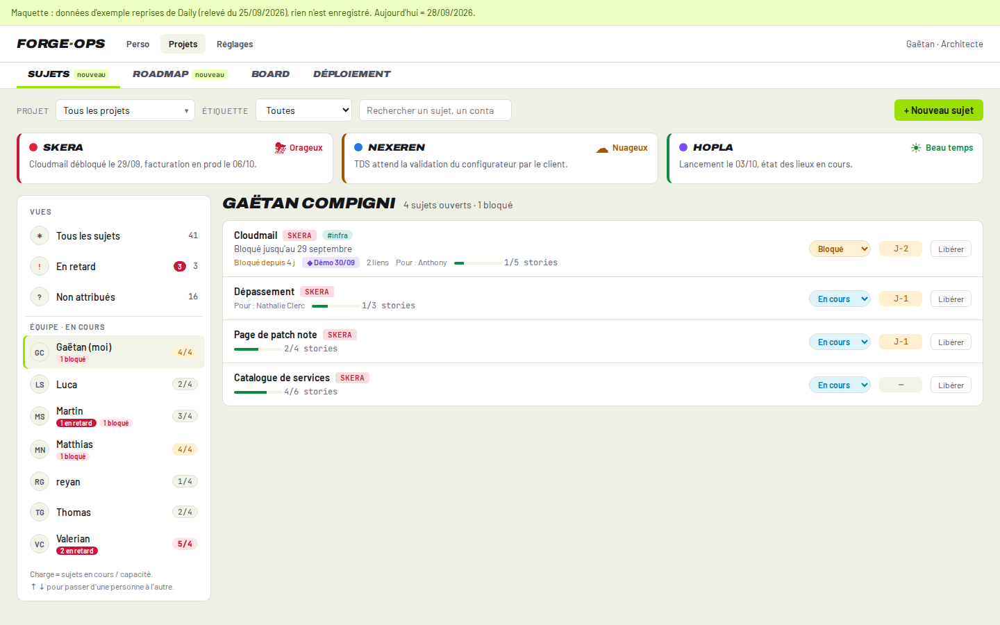

### Weather card, hover detail
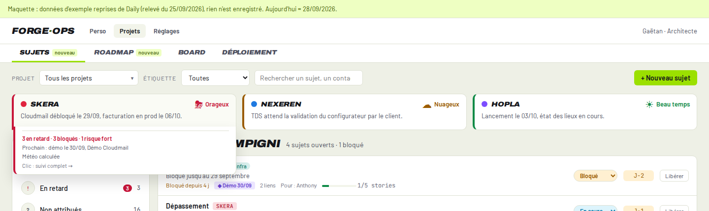

### Project follow-up
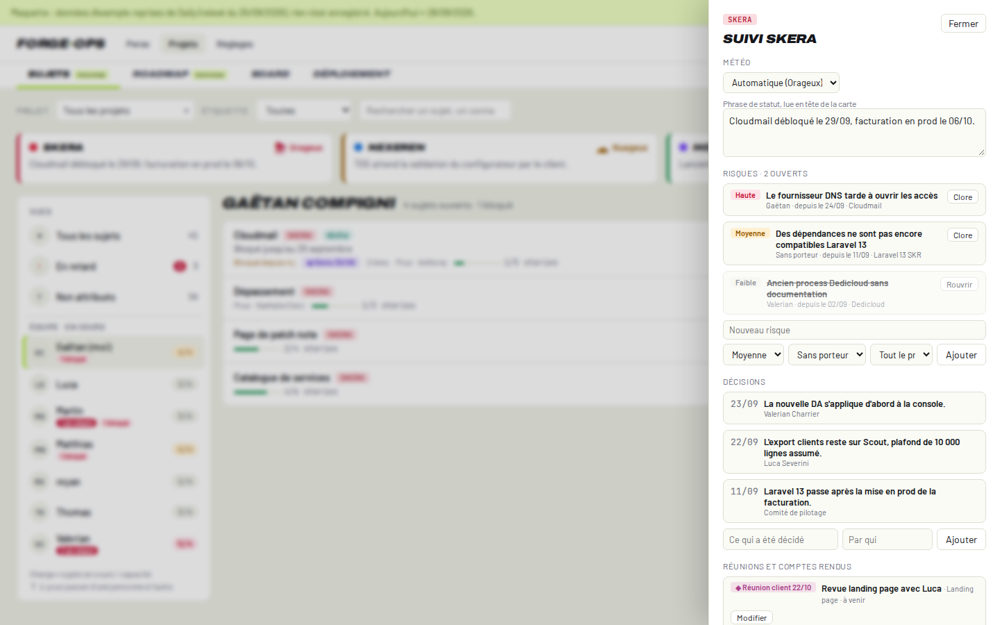

### Subject drawer
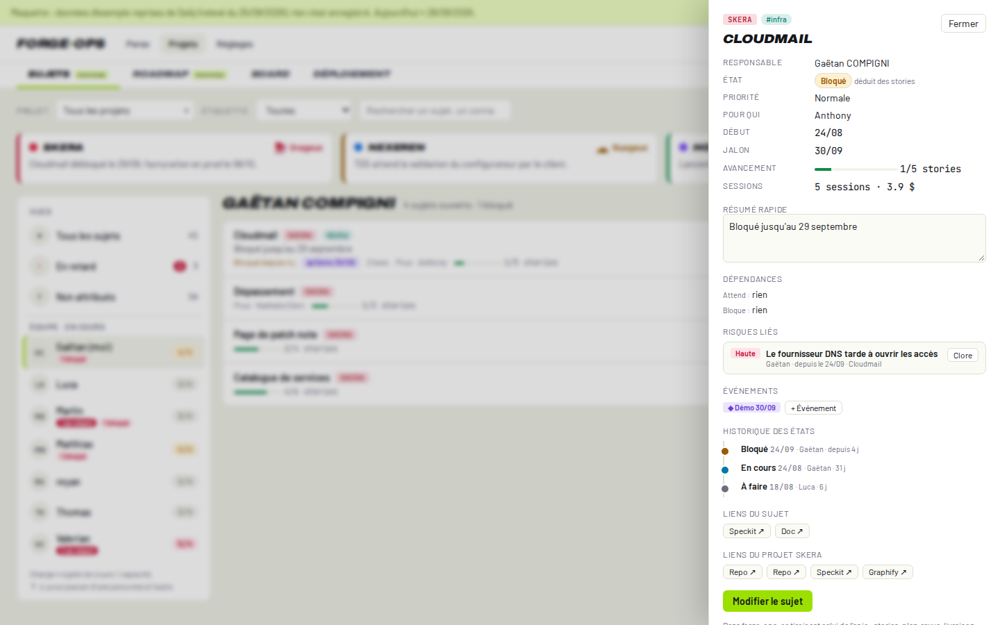

### Subject form
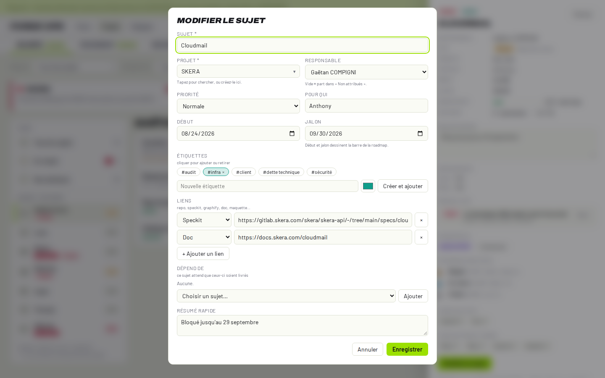

### All subjects
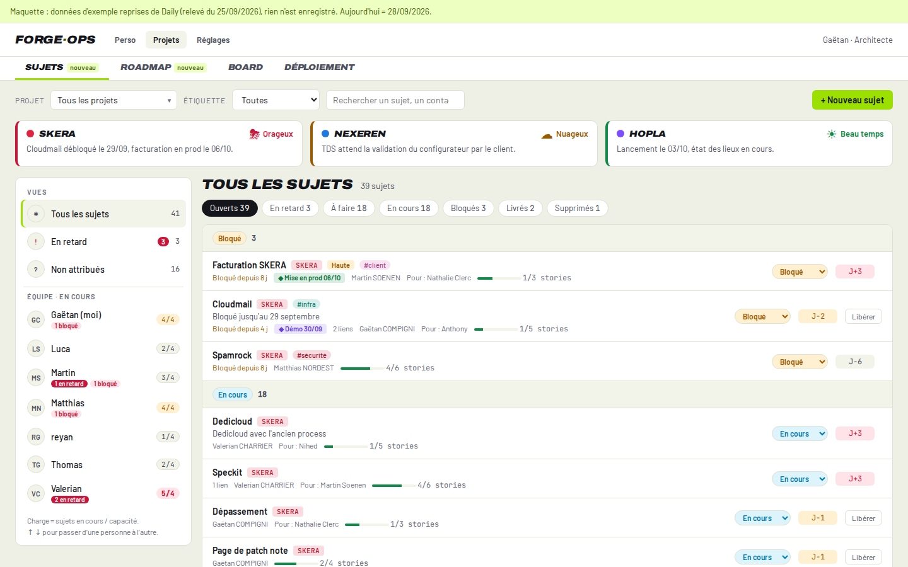

### Roadmap
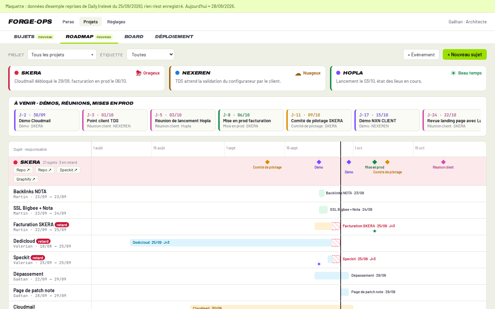

### Event with minutes
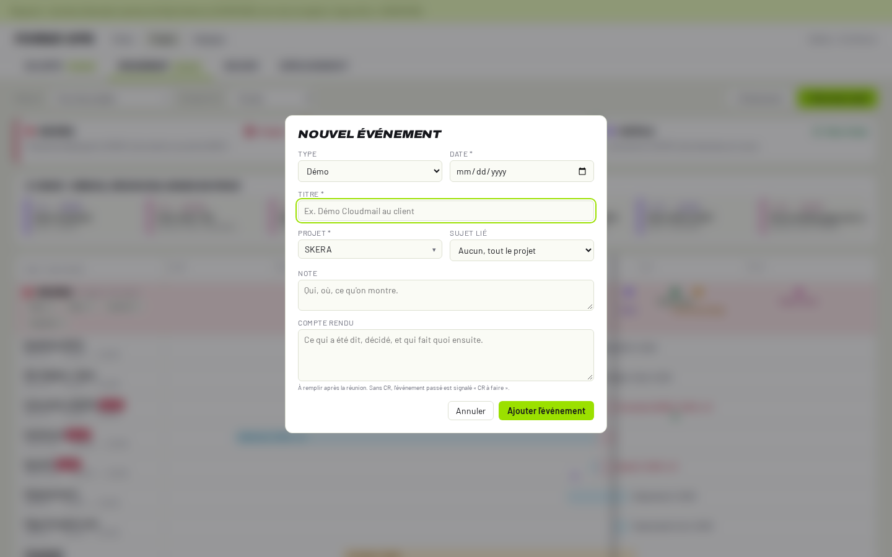

### My forge, Kanban
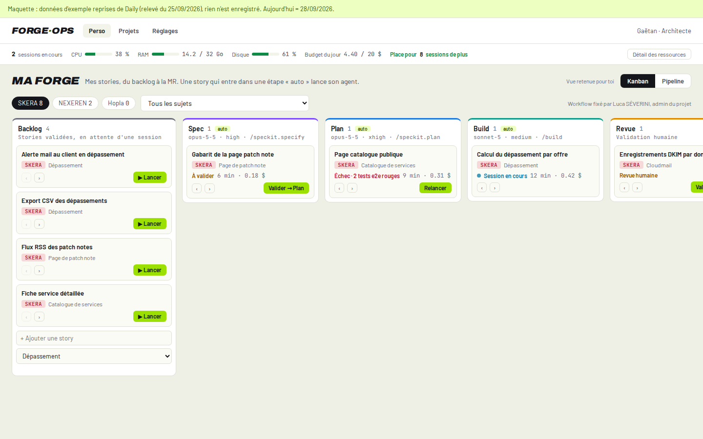

### My forge, Pipeline
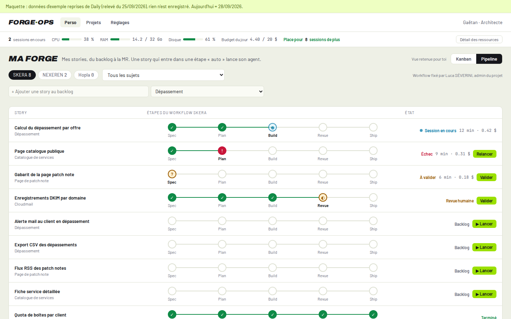

### Card conversation
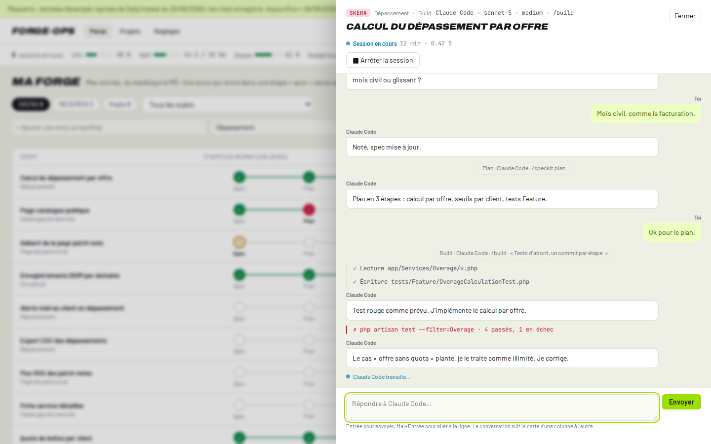

### Workflow settings, admin only
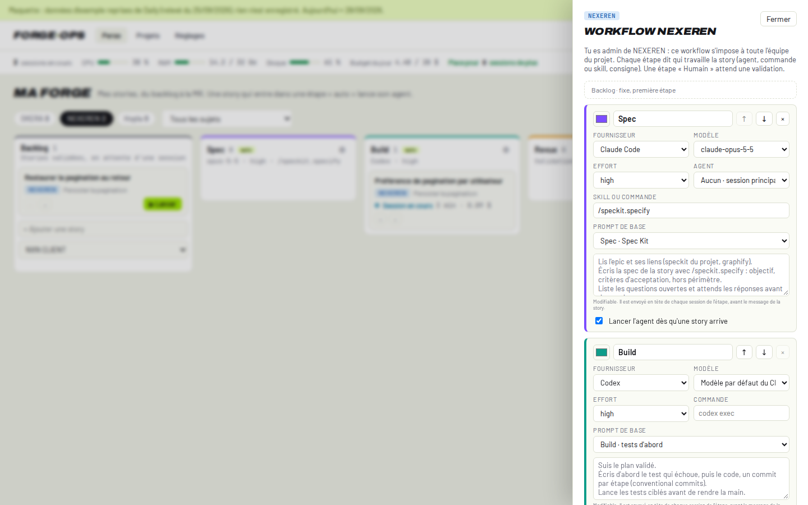

### Project without a workflow
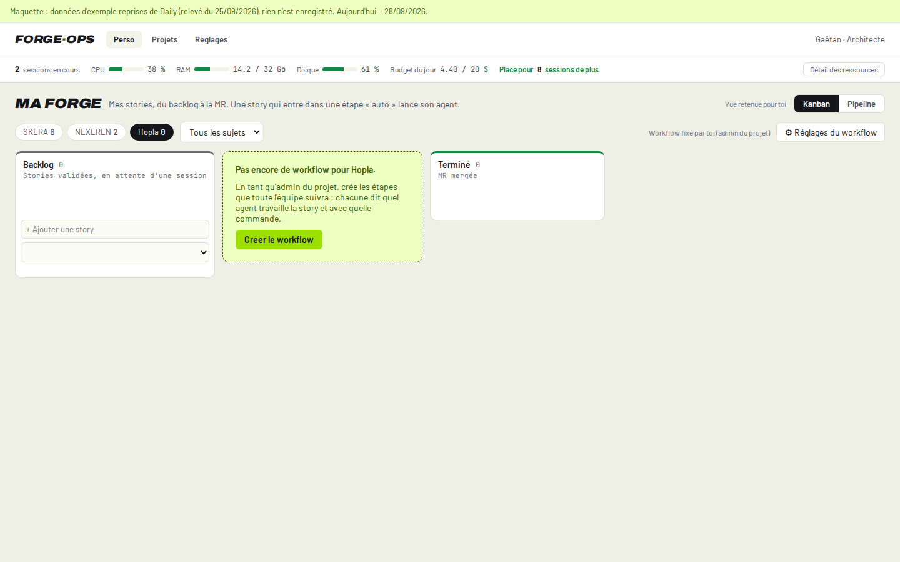

### Resources
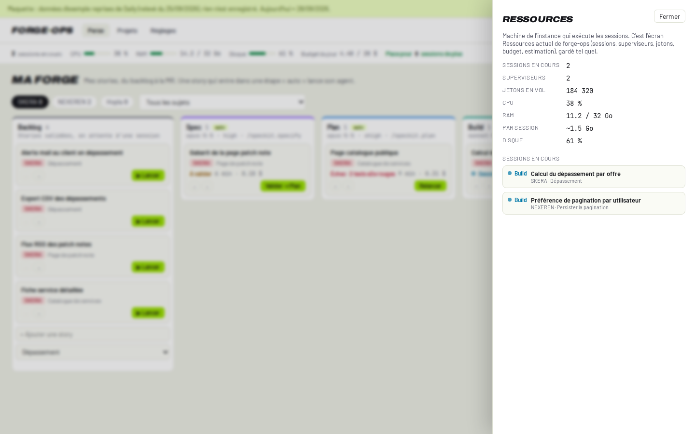

### Settings, projects
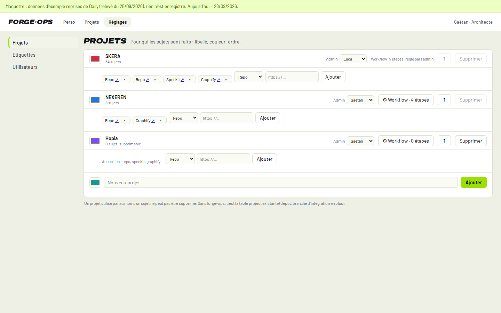

### Settings, users
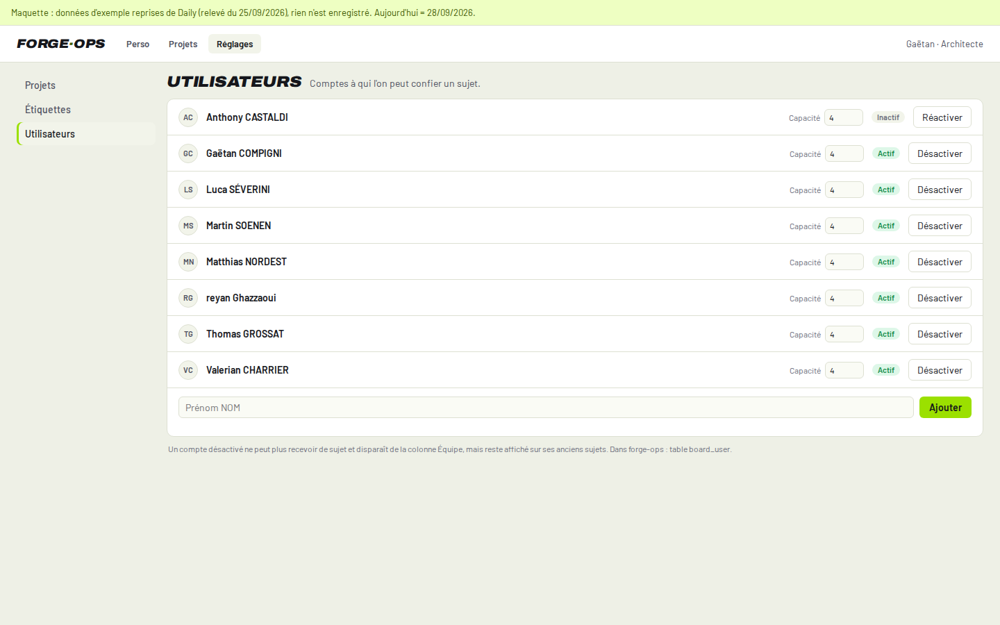

### Mobile
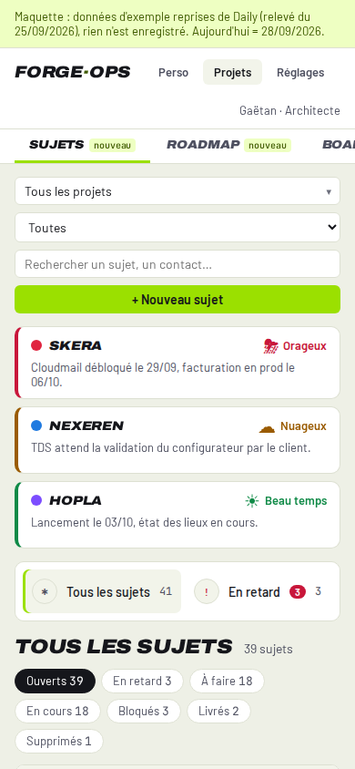
